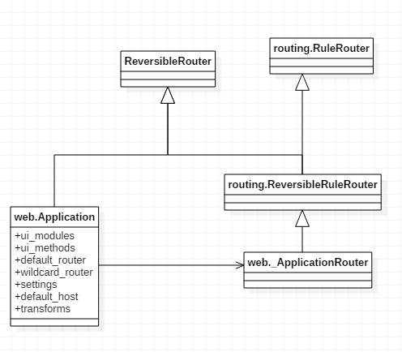
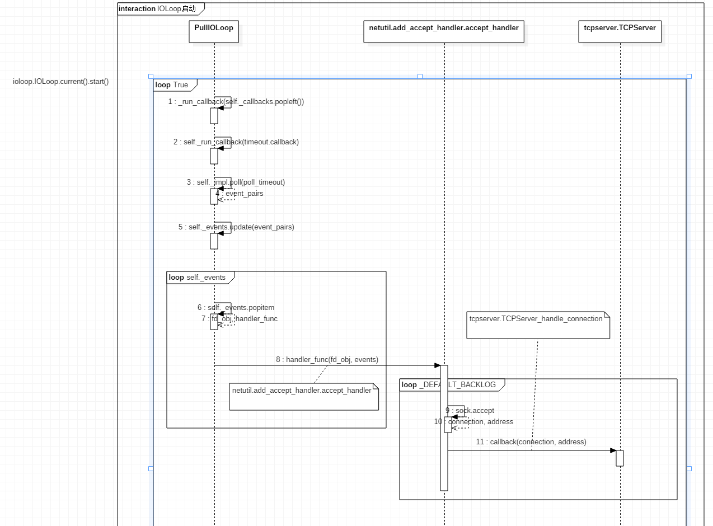

Tornado版本为4.4.2

## 0x01. 一般启动代码示例

代码片段1
```
    import tornado.ioloop
    import tornado.web

    application = web.Application([
        (r"/", MainPageHandler),
    ])
    http_server = httpserver.HTTPServer(application)
    http_server.listen(8080)
    ioloop.IOLoop.current().start()
```

## 0x02. 开始分析

### 一. application的创建

tornado.web.Application类的__init__方法如下：
```
    def __init__(self, handlers=None, default_host=None, transforms=None,
                 **settings):
        if transforms is None:
            self.transforms = []
            if settings.get("compress_response") or settings.get("gzip"):
                self.transforms.append(GZipContentEncoding)
        else:
            self.transforms = transforms
        self.default_host = default_host
        self.settings = settings
        self.ui_modules = {'linkify': _linkify,
                           'xsrf_form_html': _xsrf_form_html,
                           'Template': TemplateModule,
                           }
        self.ui_methods = {}
        self._load_ui_modules(settings.get("ui_modules", {}))
        self._load_ui_methods(settings.get("ui_methods", {}))
        if self.settings.get("static_path"):
            path = self.settings["static_path"]
            handlers = list(handlers or [])
            static_url_prefix = settings.get("static_url_prefix",
                                             "/static/")
            static_handler_class = settings.get("static_handler_class",
                                                StaticFileHandler)
            static_handler_args = settings.get("static_handler_args", {})
            static_handler_args['path'] = path
            for pattern in [re.escape(static_url_prefix) + r"(.*)",
                            r"/(favicon\.ico)", r"/(robots\.txt)"]:
                handlers.insert(0, (pattern, static_handler_class,
                                    static_handler_args))

        if self.settings.get('debug'):
            self.settings.setdefault('autoreload', True)
            self.settings.setdefault('compiled_template_cache', False)
            self.settings.setdefault('static_hash_cache', False)
            self.settings.setdefault('serve_traceback', True)

        self.wildcard_router = _ApplicationRouter(self, handlers)
        self.default_router = _ApplicationRouter(self, [
            Rule(AnyMatches(), self.wildcard_router)
        ])

        # Automatically reload modified modules
        if self.settings.get('autoreload'):
            from tornado import autoreload
            autoreload.start()
```
1. 请求输出内容的转码(后面进行分析 TODO)
```
    if transforms is None:
        self.transforms = []
        if settings.get("compress_response") or settings.get("gzip"):
            self.transforms.append(GZipContentEncoding)
    else:
        self.transforms = transforms
```
2. 加载自定义的UIModule和UIMethod

```
    self._load_ui_modules(settings.get("ui_modules", {}))
    self._load_ui_methods(settings.get("ui_methods", {}))
```
3. 静态资源路径配置
4. 路由配置
```
    self.wildcard_router = _ApplicationRouter(self, handlers)
    self.default_router = _ApplicationRouter(self, [
        Rule(AnyMatches(), self.wildcard_router)
    ])
```

至此，可得到Application的基本类图：



### 二 HTTPServer的创建和监听端口

#### 1. HTTPServer的创建

HTTPServer类，是TCPServer、Configurable、httputil.HTTPServerConnectionDelegate的子类声明如下：
```
    class HTTPServer(TCPServer, Configurable, httputil.HTTPServerConnectionDelegate):
```
由于是Configurable的子类，创建的实例由类方法configurable_base、configurable_default和实例方法initialize共同决定，后面再作具体分析。在HTTPServer类中这些方法为：
```

def initialize(self, request_callback, no_keep_alive=False, io_loop=None,
               xheaders=False, ssl_options=None, protocol=None,
               decompress_request=False,
               chunk_size=None, max_header_size=None,
               idle_connection_timeout=None, body_timeout=None,
               max_body_size=None, max_buffer_size=None):
    self.request_callback = request_callback
    self.no_keep_alive = no_keep_alive
    self.xheaders = xheaders
    self.protocol = protocol
    self.conn_params = HTTP1ConnectionParameters(
        decompress=decompress_request,
        chunk_size=chunk_size,
        max_header_size=max_header_size,
        header_timeout=idle_connection_timeout or 3600,
        max_body_size=max_body_size,
        body_timeout=body_timeout)
    TCPServer.__init__(self, io_loop=io_loop, ssl_options=ssl_options,
                       max_buffer_size=max_buffer_size,
                       read_chunk_size=chunk_size)
    self._connections = set()

@classmethod
def configurable_base(cls):
    return HTTPServer

@classmethod
def configurable_default(cls):
    return HTTPServer
```
#### 2.监听端口
```
http_server.listen(8080)
```
listen方法在类TCPServer中实现：
```
# tcpserver.TcpServer
def listen(self, port, address=""):
    """Starts accepting connections on the given port.

    This method may be called more than once to listen on multiple ports.
    `listen` takes effect immediately; it is not necessary to call
    `TCPServer.start` afterwards.  It is, however, necessary to start
    the `.IOLoop`.
    """
    sockets = bind_sockets(port, address=address)
    self.add_sockets(sockets)
```
其中，bind_sokets是 tornado.netutil中的方法,创建监听套节字绑定到给定的端口和地址，并返回创建的所有套接字。


#### 3.TcpServer.add_sockets(sockets)
作用是让server开始接收在所给的socket上连接。
代码如下:
```
    def add_sockets(self, sockets):
        """Makes this server start accepting connections on the given sockets.

        The ``sockets`` parameter is a list of socket objects such as
        those returned by `~tornado.netutil.bind_sockets`.
        `add_sockets` is typically used in combination with that
        method and `tornado.process.fork_processes` to provide greater
        control over the initialization of a multi-process server.
        """
        if self.io_loop is None:
            self.io_loop = IOLoop.current()

        for sock in sockets:
            self._sockets[sock.fileno()] = sock
            add_accept_handler(sock, self._handle_connection,
                               io_loop=self.io_loop)
```
其中，add_accept_handler方法在tornado.netutil中，关键代码如下：
```
    def add_accept_handler(sock, callback, io_loop=None):
        if io_loop is None:
            io_loop = IOLoop.current()

        def accept_handler(fd, events):
            # Instead, we use the (default) listen backlog as a rough
            # heuristic for the number of connections we can reasonably
            # accept at once.
            # 限制最大连接数
            for i in xrange(_DEFAULT_BACKLOG):
                try:
                    connection, address = sock.accept()
                except socket.error as e:
                    # _ERRNO_WOULDBLOCK indicate we have accepted every
                    # connection that is available.
                    if errno_from_exception(e) in _ERRNO_WOULDBLOCK:
                        return
                    # ECONNABORTED indicates that there was a connection
                    # but it was closed while still in the accept queue.
                    # (observed on FreeBSD).
                    if errno_from_exception(e) == errno.ECONNABORTED:
                        continue
                    raise
                callback(connection, address)
        # 添加流
        io_loop.add_handler(sock, accept_handler, IOLoop.READ)
```


#### io_loop.add_handler(sock, accept_handler, IOLoop.READ)
作用：给I/O绑定事件

```
    def add_handler(self, fd, handler, events):
        fd, obj = self.split_fd(fd)
        self._handlers[fd] = (obj, stack_context.wrap(handler))
        self._impl.register(fd, events | self.ERROR)
```

### 对IO的监听。
[http://www.cnblogs.com/JohnABC/p/6076006.html]
启动监听代码如下：
```
ioloop.IOLoop.current().start()
```
 以PollIOLoop类为例：
 重要代码：

 ```
    def start(self):
        while True:
            ...
            ...
            # 处理回调
            for i in range(ncallbacks):
                self._run_callback(self._callbacks.popleft())
            # 处理超时事件
            for timeout in due_timeouts:
                if timeout.callback is not None:
                    self._run_callback(timeout.callback)
            # Closures may be holding on to a lot of memory, so allow
            # them to be freed before we go into our poll wait.
            due_timeouts = timeout = None
            if self._callbacks:
                # If any callbacks or timeouts called add_callback,
                # we don't want to wait in poll() before we run them.
                poll_timeout = 0.0
            elif self._timeouts:
                # If there are any timeouts, schedule the first one.
                # Use self.time() instead of 'now' to account for time
                # spent running callbacks.
                poll_timeout = self._timeouts[0].deadline - self.time()
                poll_timeout = max(0, min(poll_timeout, _POLL_TIMEOUT))
            else:
                # No timeouts and no callbacks, so use the default.
                poll_timeout = _POLL_TIMEOUT
            if not self._running:
                break
            if self._blocking_signal_threshold is not None:
                # clear alarm so it doesn't fire while poll is waiting for
                # events.
                signal.setitimer(signal.ITIMER_REAL, 0, 0)
            try:
                # 查询epoll对象，看是否有任何关注的event被触发。
                # 参数poll_timeout表示，我们会等待poll_timeout秒来看是否有event发生。
                event_pairs = self._impl.poll(poll_timeout)
            except Exception as e:
                # Depending on python version and IOLoop implementation,
                # different exception types may be thrown and there are
                # two ways EINTR might be signaled:
                # * e.errno == errno.EINTR
                # * e.args is like (errno.EINTR, 'Interrupted system call')
                if errno_from_exception(e) == errno.EINTR:
                    continue
                else:
                    raise
            if self._blocking_signal_threshold is not None:
                signal.setitimer(signal.ITIMER_REAL,
                                 self._blocking_signal_threshold, 0)

            # Pop one fd at a time from the set of pending fds and run
            # its handler. Since that handler may perform actions on
            # other file descriptors, there may be reentrant calls to
            # this IOLoop that modify self._events
            self._events.update(event_pairs)
            while self._events:
                fd, events = self._events.popitem()
                try:
                    fd_obj, handler_func = self._handlers[fd]
                    handler_func(fd_obj, events)
                except (OSError, IOError) as e:
                    if errno_from_exception(e) == errno.EPIPE:
                        # Happens when the client closes the connection
                        pass
                    else:
                        self.handle_callback_exception(self._handlers.get(fd))
                except Exception:
                    self.handle_callback_exception(self._handlers.get(fd))
            fd_obj = handler_func = None
 ```
对网络请求进行处理的代码段如下：
```
    fd_obj, handler_func = self._handlers[fd]
    handler_func(fd_obj, events)
```
其中handler_func最终指向为 handler_func-->netutil.add_accept_handler.accept_handler-->tcpserver.TCPServer_handle_connection。
这样，就可以开始处理网络请求数据了。

ioloop的启动流程图如下：


